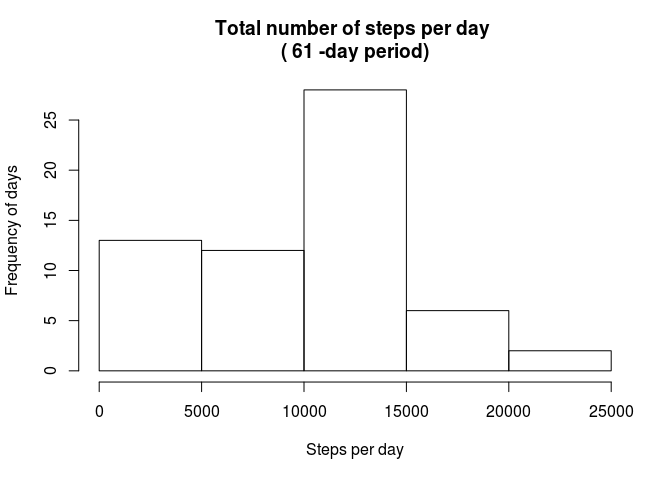
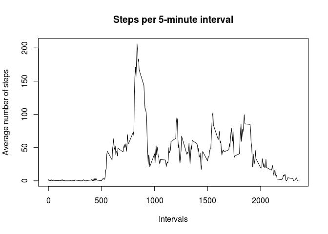
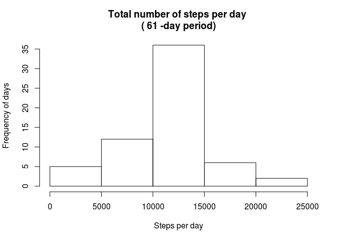
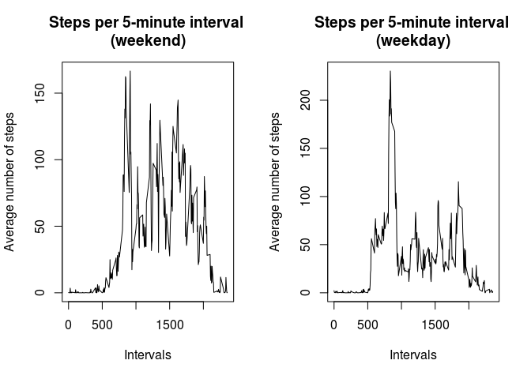

# Reproducible Research: Peer Assessment 1


## Setting programming environment
- Clean up

```r
rm(list=ls())
```


- Load libraries

```r
library(lubridate)
library(dplyr)
```

```
## 
## Attaching package: 'dplyr'
## 
## The following objects are masked from 'package:lubridate':
## 
##     intersect, setdiff, union
## 
## The following object is masked from 'package:stats':
## 
##     filter
## 
## The following objects are masked from 'package:base':
## 
##     intersect, setdiff, setequal, union
```


## Loading and preprocessing the data
- Read raw dataset

```r
activity_raw <- read.csv("activity.csv")
```


- Convert strings to lubridates

```r
activity <- activity_raw %>% mutate(date=ymd(date))
```


## What is mean total number of steps taken per day?
- Calculate the total number of steps taken per day

```r
steps_per_day <- activity %>% 
        group_by(date) %>% 
        do (
                mutate(., sum=sum(steps, na.rm = T)
                       , mean=mean(steps, na.rm = T)
                       , median=median(steps, na.rm = T)
                )
        ) %>%
        distinct(date)

steps_per_day %>% select(date, sum)
```

```
## Source: local data frame [61 x 2]
## Groups: date
## 
##          date   sum
## 1  2012-10-01     0
## 2  2012-10-02   126
## 3  2012-10-03 11352
## 4  2012-10-04 12116
## 5  2012-10-05 13294
## 6  2012-10-06 15420
## 7  2012-10-07 11015
## 8  2012-10-08     0
## 9  2012-10-09 12811
## 10 2012-10-10  9900
## ..        ...   ...
```


- Make a histogram of the total number of steps taken each day

```r
total_days <- as.numeric(max(steps_per_day$date) - min(steps_per_day$date) + 1)
hist(steps_per_day$sum
        , main = paste("Total number of steps per day","\n(",total_days,"-day period)")
        , xlab="Steps per day"
        , ylab="Frequency of days"
)
```

 


- Calculate and report the mean and median of the total number of steps taken per day

```r
steps_per_day %>% select(date, mean, median)
```

```
## Source: local data frame [61 x 3]
## Groups: date
## 
##          date     mean median
## 1  2012-10-01      NaN     NA
## 2  2012-10-02  0.43750      0
## 3  2012-10-03 39.41667      0
## 4  2012-10-04 42.06944      0
## 5  2012-10-05 46.15972      0
## 6  2012-10-06 53.54167      0
## 7  2012-10-07 38.24653      0
## 8  2012-10-08      NaN     NA
## 9  2012-10-09 44.48264      0
## 10 2012-10-10 34.37500      0
## ..        ...      ...    ...
```


## What is the average daily activity pattern?
- Make a time series plot (i.e. type = "l") of the 5-minute interval (x-axis) and the average number of steps taken, averaged across all days (y-axis)

```r
five_m_int <- activity %>% 
        group_by(interval) %>% 
        mutate( mean=mean(steps, na.rm = T)) %>%
        distinct(interval)

with(five_m_int, 
        plot(interval, mean, type = "l"
                , main="Steps per 5-minute interval"
                , xlab="Intervals"
                , ylab="Average number of steps"
        )
)
```

 


- Which 5-minute interval, on average across all the days in the dataset, contains the maximum number of steps?

```r
mxmean <- max(five_m_int$mean)
five_m_int[ five_m_int$mean == mxmean, c("interval", "mean")]
```

```
## Source: local data frame [1 x 2]
## Groups: interval
## 
##   interval     mean
## 1      835 206.1698
```


## Imputing missing values
- Calculate and report the total number of missing values in the dataset (i.e. the total number of rows with NAs)

```r
n_complete <- sum(complete.cases(activity))
n_total <- dim(activity)[1]
n_total - n_complete
```

```
## [1] 2304
```


- Devise a strategy for filling in all of the missing values in the dataset. 

The strategy for imputing the missing values in the column *steps* will be to replace all NAs by the mean number of steps for that 5-minute interval (averaged across all days).


- Create a new dataset that is equal to the original dataset but with the missing data filled in.


```r
imputation_values <- five_m_int  %>% select(interval, mean)
activity_new <- left_join(
                activity
                , imputation_values
                , by="interval"
                , copy=T
        )

index <- which(is.na(activity_new$steps))
nmax <- length(index)
for (i in 1:nmax){
        index_i <- index[i]
        activity_new$steps[index_i] <- activity_new$mean[index_i] 
}

activity_new <- activity_new %>% select(steps, date, interval)
```


- Make a histogram of the total number of steps taken each day and Calculate and report the mean and median total number of steps taken per day.


```r
### calculate the total number of steps taken per day
steps_per_day2 <- activity_new %>% 
        group_by(date) %>% 
        do (
                mutate(., sum=sum(steps, na.rm = T)
                       , mean=mean(steps, na.rm = T)
                       , median=median(steps, na.rm = T)
                )
        ) %>%
        distinct(date)

### make a histogram of the total number of steps taken each day
total_days2 <- as.numeric(max(steps_per_day2$date) - min(steps_per_day2$date) + 1)
hist(steps_per_day2$sum
     , main = paste("Total number of steps per day","\n(",total_days2,"-day period)")
     , xlab="Steps per day"
     , ylab="Frequency of days"
)
```

 

```r
### calculate and report the mean and median of the total number of steps taken per day
steps_per_day2 %>% select(date, mean, median)
```

```
## Source: local data frame [61 x 3]
## Groups: date
## 
##          date     mean   median
## 1  2012-10-01 37.38260 34.11321
## 2  2012-10-02  0.43750  0.00000
## 3  2012-10-03 39.41667  0.00000
## 4  2012-10-04 42.06944  0.00000
## 5  2012-10-05 46.15972  0.00000
## 6  2012-10-06 53.54167  0.00000
## 7  2012-10-07 38.24653  0.00000
## 8  2012-10-08 37.38260 34.11321
## 9  2012-10-09 44.48264  0.00000
## 10 2012-10-10 34.37500  0.00000
## ..        ...      ...      ...
```


- Do these values differ from the estimates from the first part of the assignment? 

Yes.

- What is the impact of imputing missing data on the estimates of the total daily number of steps?

Frequencies seem to be normalized.


## Are there differences in activity patterns between weekdays and weekends?

- Create a new factor variable in the dataset with two levels – “weekday” and “weekend” indicating whether a given date is a weekday or weekend day.


```r
nrows <- dim(activity_new)[1]
day_type <- NULL
for (i in 1:nrows){
        date_i <- wday(activity_new[i, "date"])
        if (date_i == 1) {
                day_type <- c(day_type,"weekend")
        }
        else if (date_i == 7) {
                day_type <- c(day_type,"weekend")
        }
        else {
                day_type <- c(day_type,"weekday")
        }
}

activity_new <- data.frame(activity_new,day_type)
```


- Make a panel plot containing a time series plot (i.e. type = "l") of the 5-minute interval (x-axis) and the average number of steps taken, averaged across all weekday days or weekend days (y-axis). See the README file in the GitHub repository to see an example of what this plot should look like using simulated data.


```r
five_m_int2 <- activity_new %>% 
        group_by(interval, day_type) %>% 
        mutate( mean=mean(steps, na.rm = T)) %>%
        distinct(interval, day_type)

par(mfrow=c(1,2))
with(five_m_int2[five_m_int2$day_type=="weekend", ], 
     plot(interval, mean, type = "l"
          , main=paste("Steps per 5-minute interval","\n(weekend)")
          , xlab="Intervals"
          , ylab="Average number of steps"
     )
)
with(five_m_int2[five_m_int2$day_type=="weekday", ], 
     plot(interval, mean, type = "l"
          , main=paste("Steps per 5-minute interval","\n(weekday)")
          , xlab="Intervals"
          , ylab="Average number of steps"
     )
)
```

 


